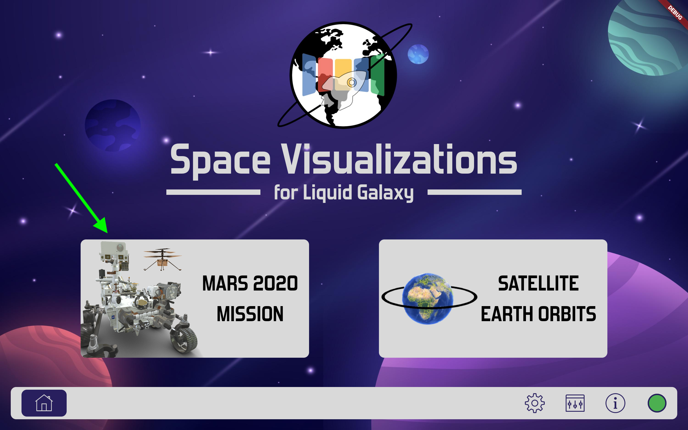
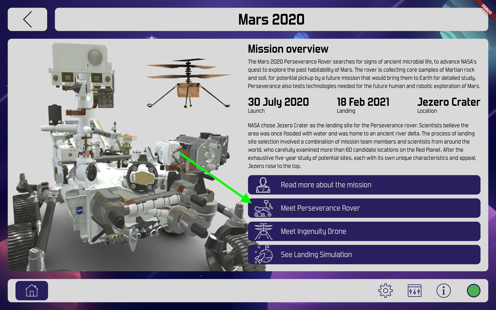
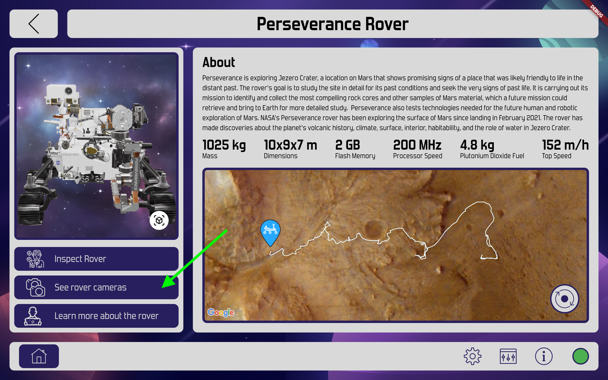
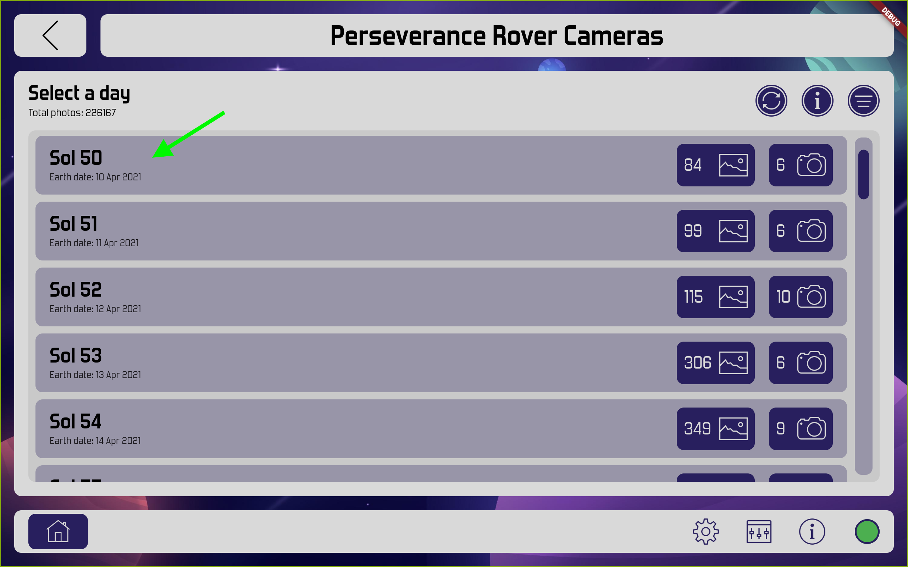
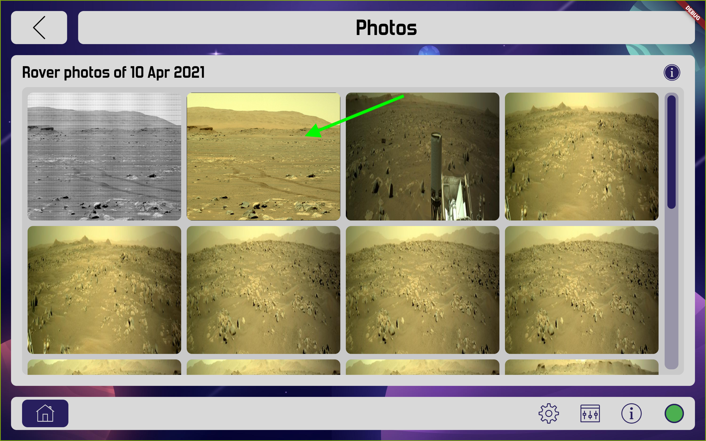
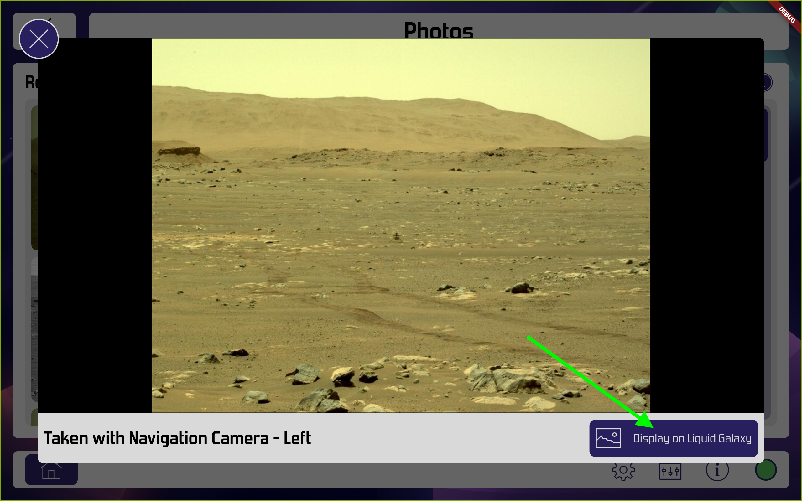
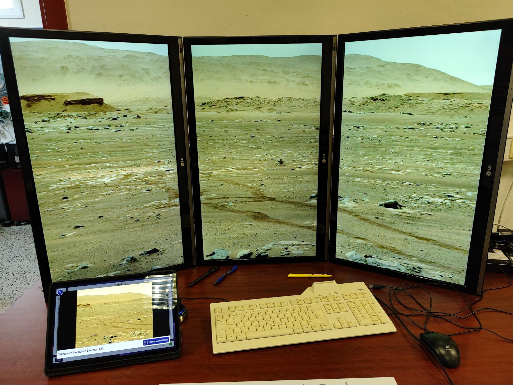
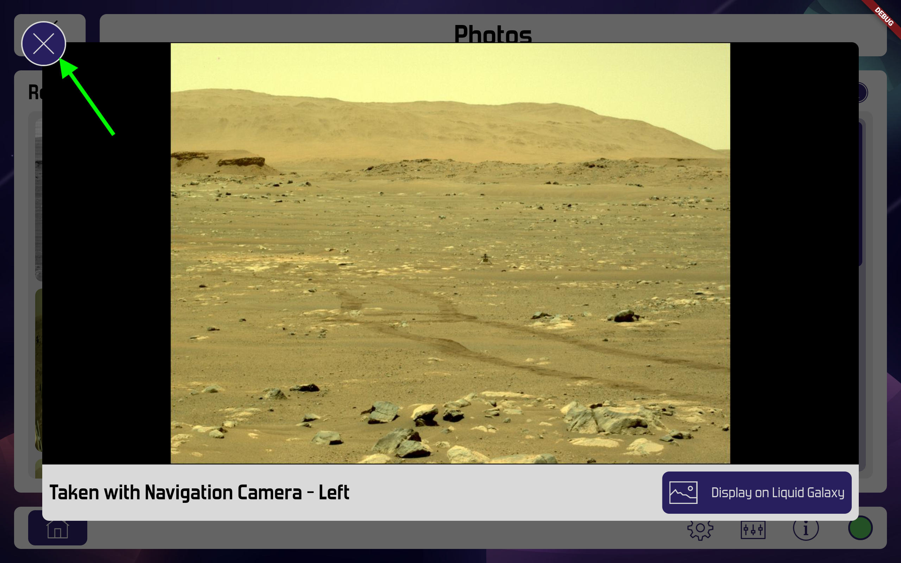

# 🚀 Display Images Service

📚 About
-----------------

The Display Images Service is a Node.js service designed to display images on the Liquid Galaxy screens. It is used in the LG Space Visualizations app to show rover images from the Mars 2020 Mission on the Liquid Galaxy using Chromium pages.

📝 Before Running
-----------------

1.  Ensure the Liquid Galaxy core is installed. More information about the installation can be found in this [repository](https://github.com/LiquidGalaxyLAB/liquid-galaxy).

2.  Ensure **Node.js version 16** is installed on the master machine by running:


```bash
node -v
```

1.  The output should look like v16.20.2. If not, install the correct version by running:


```bash
curl -sL https://deb.nodesource.com/setup\_16.x | sudo -E bash -
sudo apt-get install nodejs -y
```

1.  After installing Node.js, install pm2 on the master machine. Execute the command:


```bash
sudo npm i -g pm2
```

👨‍💻 Installing The Service
---------------------------

First, open a new terminal and navigate to the home directory with the command:

```bash
cd
```

Next, clone the repository in the home directory of the master machine with the command:

```bash
git clone https://github.com/0xbaggi/display_images_service.git
```
Once cloned, navigate to the cloned folder and execute the installation script with the following commands:
```bash
cd display_images_service
bash install.sh {sudo-password}
```
> _The {sudo-password} is the master sudo password._

After installation, reboot the machine.

🛠️ Testing the Service
-----------------------

If the service is installed correctly, you can test it by running the following command:

```bash
sudo pm2 list
```

The output should look like this:

🚀 Usage
--------

Now you can display the images on the Liquid Galaxy from the LG Space Visualizations app:

1.  Open the LG Space Visualizations app and connect to the Liquid Galaxy.

2.  Go to the Mars 2020 Mission section from the homepage.

    

3. Navigate to Meet Perseverance Rover

    

4. Click on See rover cameras.

   

5. Select a day from the list.

   

6. Choose the image you want to display from the list.

   

7. Click on the Display on Liquid Galaxy button to display the image on the Liquid Galaxy.

   

8. The image will be displayed on the Liquid Galaxy in a few seconds. (first time should take more time)

    

9. To close the image on Liquid Galaxy, click on the Close button on the top left of the pop-up in the application.

   
